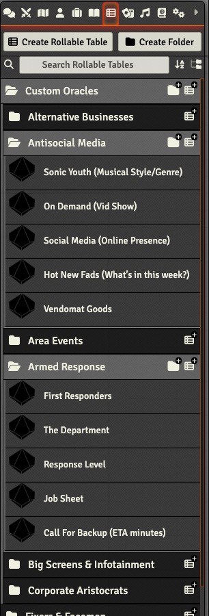
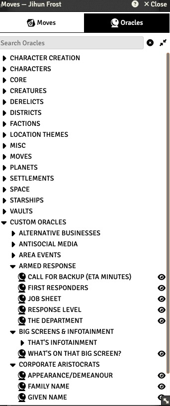

# augmented-reality-foundry


[](https://github.com/jendave/augmented-reality-foundry/releases/latest)

[](LICENSE)

# About
A FoundryVTT compendium of rolltables and macros for [Augmented Reality: The Holistic City Kit For Cyberpunk Games](https://preview.drivethrurpg.com/en/product/202175/augmented-reality-the-holistic-city-kit-for-cyberpunk-games) by Paul Gallagher.

Augmented Reality can also be found at the following links:
* [itch.io](https://p-d-gallagher.itch.io/augmented-reality)
* [Dungeon Masters Guild](https://www.dmsguild.com/product/202175/Augmented-Reality-The-Holistic-City-Kit-For-Cyberpunk-Games?language=esFfiltersD)

# Features and Notes
* Enhance your games of the dark future, with the easy to use Augmented Reality Cyberpunk City Kit. Inside, you’ll find over 50 tables designed to assist gamesmasters who need to improvise futuristic city details, or who have found that they are unprepared for where their players are heading.
* Rolltables and macros for the tables in the FoundryVTT module.
* System-neutral.

# Module Installation
To install the module, click on `Install Module` and search for `augmented` in the `Add-On Modules` tab of the Foundry VTT game setup screen. Then click on `Install`.

Or use this URL and click on `Install`:

```
https://github.com/jendave/augmented-reality-foundry-foundry/releases/latest/download/module.json
```

## Install Macros
Macros for the kit can be found in the `Augmented Reality Macros` compendium. Drag and drop any you need into the macro toolbar.

## Ironsworn/Starforged Tip - Use Custom Folders to add Character Sheet Oracles 
* Use this method to add the Augmented Reality kit.
* If it does not already exist, create a `Custom Oracles` folder in `Rollable Tables` tab called:
  * `Custom Oracles` - EN
  * `Oráculos personalizados` - ES
  * `Oracles personnalisés` - FR
  * `Własne Wyrocznie` - PL

Open the `Augmented Reality Rolltables` compendium and copy the folders into the `Rollable Tables` `Custom Oracles` folder.



The Oracles will be available in the Character sheet under `Custom Oracles`.



# Credits
[Augmented Reality: The Holistic City Kit For Cyberpunk Games](https://preview.drivethrurpg.com/en/product/202175/augmented-reality-the-holistic-city-kit-for-cyberpunk-games) by Paul Gallagher are used with permission from the author.

Module by David Hudson and licensed for use under the [MIT license](https://opensource.org/license/mit/).

Licenses and permissions for the macros are listed in the source code.

# Acknowledgements
## Modules
The following modules were used in the development process
* [foundryvtt-importer module](https://github.com/EthanJWright/foundryvtt-importer)
* [DF Manual Rolls](https://foundryvtt.com/packages/df-manual-rolls)
